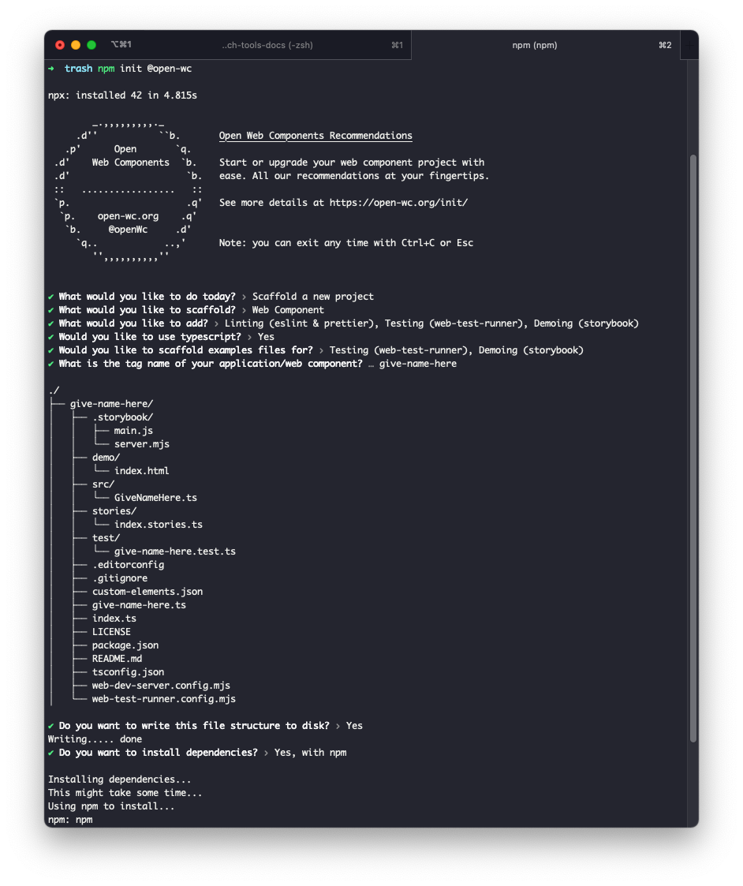

# Create LitElement Web Components using Open-WC, introducing Storybook demoing capabilities and mocha testing

[Open-WC Guide](https://open-wc.org/guides/)

Let's bootstrap together this project which will introduce:

- Eslint and Prettier code formatting
- Mocha Testing
- Storybook Demoing
- LitElement component for Development

### Project Set-Up

```
# in a new or existing folder:
npm init @open-wc
```

Which will prompt you for additional information. Here's a sample:


### Available Commands

- `npm run storybook` - demos up the LitElement component using storybook
- `npm test` - runs mocha tests
